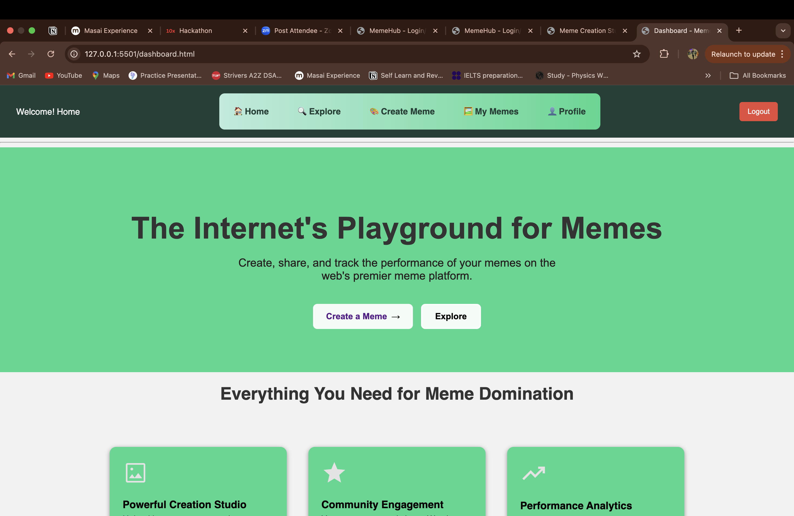
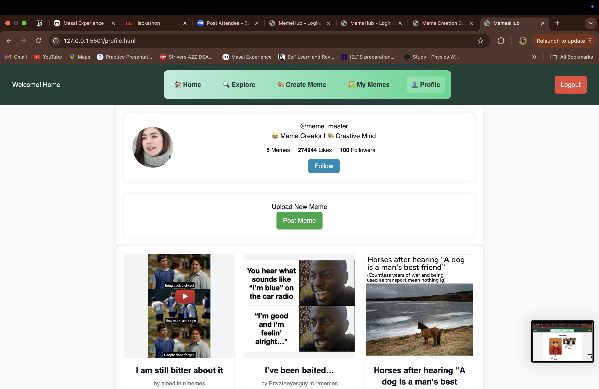
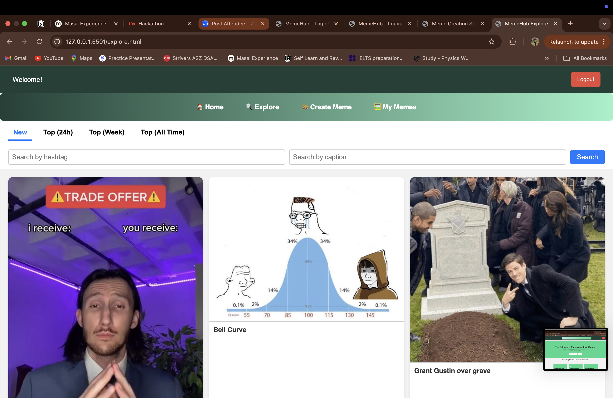
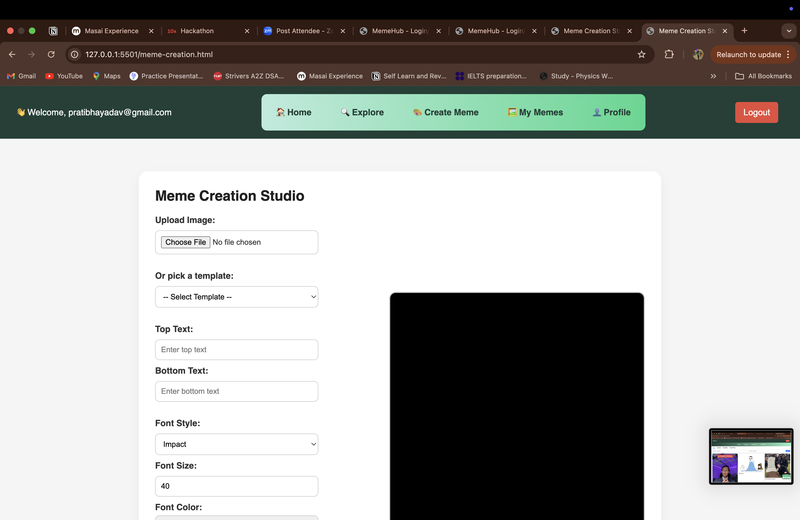
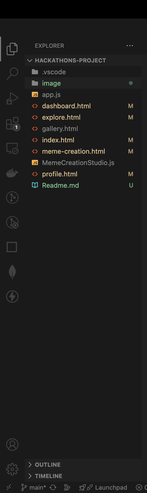

# MemeHub 🎉

MemeHub is a fun and interactive meme-sharing web application where users can explore trending memes, view personalized profiles, and maintain their own meme gallery. Built with modern web technologies, MemeHub offers a smooth, image-centric UI and prepares for future features like AI-generated captions and auto-tagging.

---

## 🔗 Live Demo

🚀 [Click here to view MemeHub Live](https://your-live-link.com) *(Replace with your deployed URL)*

---

## 🖼️ Website Preview

### Home Page

### Profile Page

### Gallery Page

### Explore Page

### Create Meme Page

---

## 🚀 Features

- 🏠 **Home Page** – Browse the latest memes in a clean feed layout  
- 🔍 **Explore Page** – Discover new and trending memes  
- 👤 **Profile Page** – View your uploaded memes and user details  
- 🖼️ **Gallery Page** – Access your saved or created memes  
- ⚙️ **(Upcoming)** – AI-powered caption generator and auto-tagging  

---

## 🛠️ Tech Stack

- **Frontend**:  HTML, CSS, JavaScript  
- **Backend/Database**: Firebase (for data storage and user auth)  
- **Libraries**: Chart.js (optional analytics), Framer Motion (animations)

---

## 📁 Project Structure

## Developed By :- Pratibha , Aasritha, Shweta